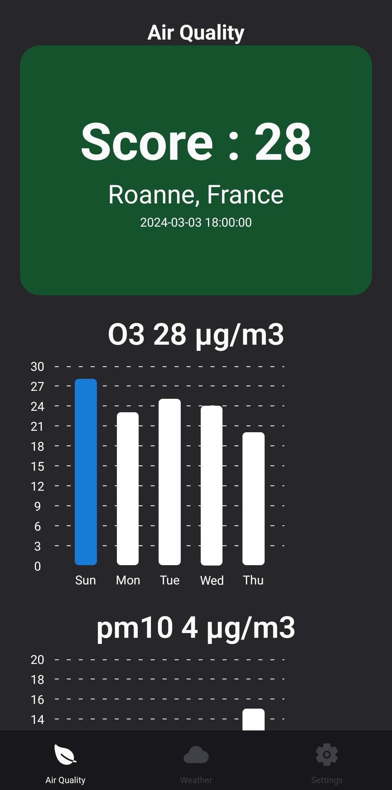
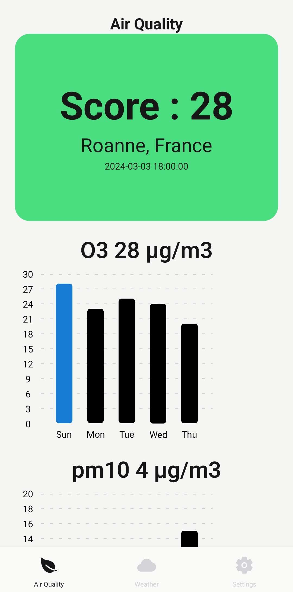

**Défi de Programmation : Création d'une Application Mobile de Suivi de la Qualité de l'Air**

La mission vous attend : créer une application mobile réactive et informative en utilisant React Native. Ce projet a pour ambition de mettre à la disposition des utilisateurs des informations cruciales sur la qualité de l'air en temps réel via l'API AQICN, le tout, agrémenté de visualisations graphiques détaillées. Vous allez non seulement développer vos compétences en programmation mobile, mais aussi contribuer à une cause environnementale importante.

### Voici les Étapes Clés pour Mener à Bien cette Mission :

1. **Configuration Incontournable** :
   - Préparation de votre environnement de développement avec React Native et un émulateur Androir en utilisant Android Studio

2. **Initialisation et Paramétrages** :
   - Création de votre projet React Native. Assurez-vous de bien configurer votre environnement pour une base solide.
   - Installation de React Navigation pour une navigation fluide entre vos écrans en utilisant un BottomTabNavigator.
   - Integration de Native Base pour enrichir votre UI avec des composants prêts à l'emploi.

3. **Design des Interface** :
   - Planifiez et construisez les écrans de votre application. Un design intuitif et attrayant est la clé pour captiver vos utilisateurs.

4. **Communication avec l'API** :
   - Créer une compte sur [AQICN](https://aqicn.org/api/) afin de récupérer votre token
   - Mise en place des appels à l'API AQICN en utilisant `fetch` ou `axios` pour récupérer les données environnementales. 

5. **Présentation des Données** :
   - Affichage des informations sur la qualité de l'air de manière lisible et accessible. Assurez-vous que les données sont facilement interprétables par vos utilisateurs.
   - Utiliser et mettre en place différent Graphique afin de visualiser les données de la qualité de l'air : 
   [react-native-gifted-charts](https://www.npmjs.com/package/react-native-gifted-charts)

### Ressources Recommandées :

- [Documentation officielle de React Native](https://reactnative.dev/docs/environment-setup).
- [Guide d'utilisation de React Navigation](https://reactnavigation.org/).
- [Native Base](https://nativebase.io/).
- [Documentation de l'API AQICN](https://aqicn.org/json-api/doc/#api-_).
- [react-native-gifted-charts](https://www.npmjs.com/package/react-native-gifted-charts)

# Proposition de design

# Allez plus loin 

Refactorisation du code en utilisant [React Redux](https://react-redux.js.org/tutorials/quick-start) ou [Redux Toolkit](https://redux-toolkit.js.org/tutorials/quick-start)

- Enregistrer les données du fetch dans un store redux grace à une action dispatchée : `mapDispatchToProps`
- Connecter les components au store redux en utilisant `mapStateToProps`
